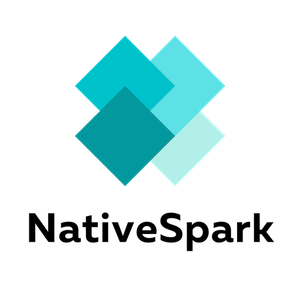
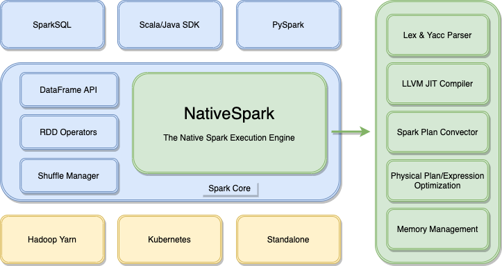
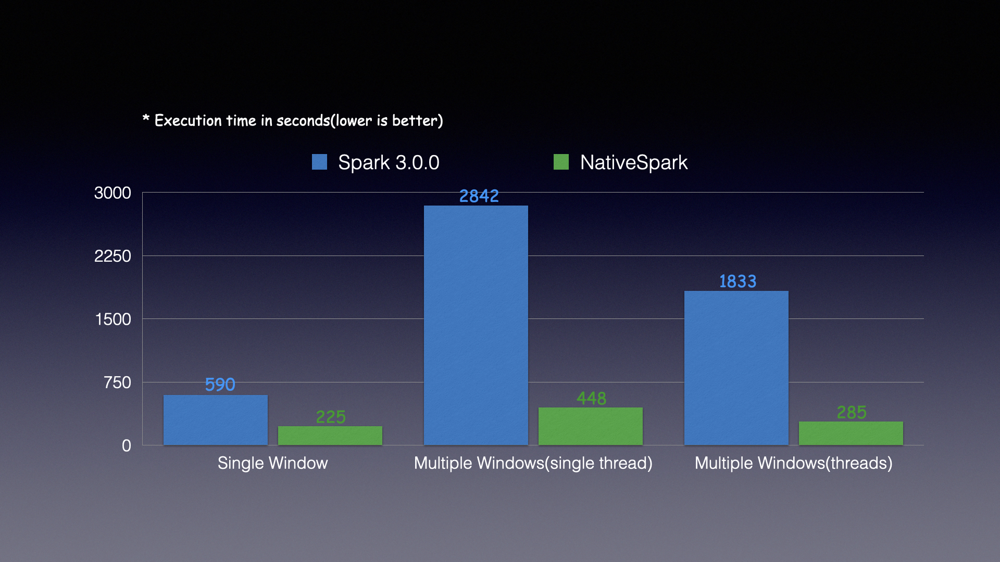

<div align=center></div>

* [**Slack Channel**](https://hybridsql-ws.slack.com/archives/C01R7L5SXPW)
* [**Discussions**](https://github.com/4paradigm/NativeSpark/discussions)
* [**README中文**](./README-CN.md)

## Introduction

NativeSpark is the LLVM-based, Spark-compatible and high-performance native execution engine. It can resolve the problems of performance and consistency for AI landing with Spark.



## Background

Why NativeSpark?

* Optimizing performance for Spark has been reach the bottleneck. Using C++ and LLVM to implement the native execution engine can leverage the modern CPU and GPU to achieve several times performance improvement.
* Spark focus on general-purpose offline computing but be short of feature engineering for machine learning and generating online features. NativeSpark can make up for the above defects and make AI landing easier.
* Comparing with other native execution engine, like Intel OAP and Nvidia spark-rapids, NativeSpark rewrite SQL optimization passes and use LLVM for JIT which is much more efficient and flexible.

Who is NativeSpark for?

* Spark users. NativeSpark is compatible with most of SparkSQL syntax. Spark users can use NativeSpark for acceleration without any code changed.
* Spark developer. If you are familiar with Spark source code or LLVM JIT, you can contribute to NativeSpark for better performance and functionality.
* Users who use Spark for ML/AI. NativeSpark provides AI-oriented syntax extensions and high-performance feature engineering which can solve online-offline consistency problem for AI landing.

Why NativeSpark is fast?

* NativeSpark is written in C++ and based on LLVM. It will optimize and generate native binary code for each hardware architecture. It rewrites the underlying SQL compiler and expression optimization passes. There are some physical plans have no CodeGen supported in Spark however NativeSpark has implemented in efficient way. NativeSpark has creatively implemented the features of multiple window concurrently computing and skew computing optimization for window data. It also has better memory management which avoid the overhead of JVM garbage collection.


What are the features of NativeSpark?

* **High Performance**

    Based on LLVM optimization, we can get more than six times performance improvement in some AI scenarios. It reduces the computing time for the same applications and get lower TCO.
    
* **No Migration Cost**

    Using NativeSpark does not require modifying or re-compiling your SparkSQL applications. Just set the SPARK_HOME then you will reap the performance benefit of native execution engine.
    
* **Optimized For Machine Learning**

    NativeSpark provided the customized join type and UDF/UDAF for machine learning scenarios which can meet the requirements for feature engineering in production environment.

* **Online-Offline consistency**

    Using [FEDB](https://github.com/4paradigm/fedb) and NativeSpark, the machine learning applications with SQL for feature engineering can be deployed without any development. The native execution engine guarantees the online-offline consistency and greatly reduces the cost of AI landing. 

* **Upstream First** 
  
    NativeSpark will be compatible with Spark 3.0 and the later versions. All the functions will be synchronized with upstream and it is able to fallback to vanilla Spark in some special scenarios.

## QuickStart

### Use Docker Image

Run with the official NativeSpark docker image.

```bash
docker run -it ghcr.io/4paradigm/nativespark bash
```

Execute the standard Spark commands which will use NativeSpark for acceleration by default.

```bash
$SPARK_HOME/bin/spark-submit \
  --master local \
  --class org.apache.spark.examples.sql.SparkSQLExample \
  $SPARK_HOME/examples/jars/spark-examples*.jar
```

### Use NativeSpark Distribution

Download the pre-built package in [Releases Page](https://github.com/4paradigm/NativeSpark/releases) then execute the Spark commands.


```bash
tar xzvf ./native-spark-3.0.0-bin-hadoop2.7.tar.gz

export SPARK_HOME=`pwd`/native-spark-3.0.0-bin-hadoop2.7/

$SPARK_HOME/bin/spark-submit \
  --master local \
  --class org.apache.spark.examples.sql.SparkSQLExample \
  $SPARK_HOME/examples/jars/spark-examples*.jar
```

## Performance

NativeSpark has significant performance improvement in most of the AI scenarios. Here are part of the benchmark results. 



You can verify the results in your environment with the following steps.

```bash
docker run -it ghcr.io/4paradigm/nativespark bash

git clone https://github.com/4paradigm/NativeSpark.git 
cd ./NativeSpark/benchmark/taxi_tour_multiple_window/

wget http://103.3.60.66:8001/nativespark_resources/taxi_tour_parquet.tar.gz
tar xzvf ./taxi_tour_parquet.tar.gz

export SPARK_HOME=/spark-3.0.0-bin-hadoop2.7/
./submit_spark_job.sh

export SPARK_HOME=/spark-3.0.0-bin-nativespark/
./submit_spark_job.sh
```

## Get Involved

You can use the official docker image for development.

```
docker run -it ghcr.io/4paradigm/nativespark bash

git clone --recurse-submodules git@github.com:4paradigm/NativeSpark.git
cd ./NativeSpark/native-spark/
```

Build the native-spark module from scratch.

| Operating System | Compile Command | Notes |
| ------- | ------ | ---- |
| Linux	  | mvn clean package| Support CentOS 6, Ubuntu and other Linux distros|
| MacOS   | mvn clean package -Pmacos | Support macOS Big Sur and later versions |
| All in one | mvn clean package -Pallinone | Support Linux and MacOS at the same time |

Build the NativeSpark distribution from scratch.

```bash
cd ../spark/

./dev/make-distribution.sh --name nativespark --pip --tgz -Phadoop-2.7 -Pyarn
```

For more information, please refer to [NativeSpark Documentation](https://docs.fedb.io/nativespark).

## Roadmap

### SQL Compatibility

NativeSpark is compatible with most SparkSQL applications now. In the future, we may perfect the compatibility for ANSI SQL and lower the migration cost for developers.


* [2021 H1&H2] Support more `Window` types and `Where`, `GroupBy` with complex expressions.

* [2021 H1&H2] Support more SQL syntax and UDF/UDAF functions for AI scenarios.

### Performance Improvement

NativeSpark has significant performance improvement with C++ and LLVM. We will reduce the cost of cross-language invocation and support heterogeneous hardware in the future.

* [2021 H1] Support multiple coded formats and be compatible with Spark UnsafeRow memory layout.
* [2021 H1] Automatically optimize the window computing and table join with skew data.
* [2021 H1] Integrate the optimization passes for Native LastJoin which is used in AI scenarios.
* [2021 H2] Support column-based memory layout in the whole process which may reduce the overhead of reading or writing files and support CPU vectorization optimization.
* [2021 H2] Support heterogeneous computing hardware.

### Ecosystem Integration

NativeSpark is compatible with Spark ecosystems currently. We may integrate with more open-source systems to meet the requirements in production environments.

* [2021 H2] Integrate with multiple versions of Spark and provide pre-built packages.

## License

[Apache License 2.0](./LICENSE)
