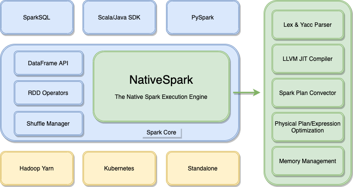

<div align=center></div>

* [**Slack Channel**](https://hybridsql-ws.slack.com/archives/C01TMST8AE7)
* [**Discussions**](https://github.com/4paradigm/SparkFE/discussions)
* [**README中文**](./README-CN.md)

## Introduction

SparkFE is the LLVM-based and high-performance Spark native execution engine which is designed for Feature Enginnering.

Spark has rapidly emerged as the de facto standard for big data processing. However, it is not designed for machine learning which has more and more limitation in AI scenarios. SparkFE rewrite the execution engine in C++ and achieve more than 6x performance improvement for feature extraction. It guarantees the online-offline consistency which makes AI landing much easier. For further details, please refer to [SparkFE Documentation](https://docs.fedb.io/sparkfe).



## Features

* **High Performance**

    Based on LLVM optimization, we can get more than 6 times performance improvement in some AI scenarios. It reduces the computing time for the same applications and get lower TCO.

* **No Migration Cost**

    Using SparkFE does not require modifying or re-compiling your SparkSQL applications. Just set the SPARK_HOME then you will reap the performance benefit of native execution engine.
    
* **Optimized For Machine Learning**

    SparkFE provided the customized join type and UDF/UDAF for machine learning scenarios which can meet the requirements for feature engineering in production environment.

* **Online-Offline consistency**

    Using [FEDB](https://github.com/4paradigm/fedb) and SparkFE, the machine learning applications with SQL for feature engineering can be deployed without any development. The native execution engine guarantees the online-offline consistency and greatly reduces the cost of AI landing. 

* **Upstream First** 
  
    SparkFE will be compatible with Spark 3.0 and the later versions. All the functions will be synchronized with upstream and it is able to fallback to vanilla Spark in some special scenarios.

## Performance

SparkFE has significant performance improvement in most of the AI scenarios. Here are part of the benchmark results. 


You can verify the results in your environment with the following steps.

```bash
docker run -it 4pdosc/sparkfe bash

git clone https://github.com/4paradigm/SparkFE.git 
cd ./SparkFE/benchmark/taxi_tour_multiple_window/

wget http://103.3.60.66:8001/sparkfe_resources/taxi_tour_parquet.tar.gz
tar xzvf ./taxi_tour_parquet.tar.gz

export SPARK_HOME=/spark-3.0.0-bin-hadoop2.7/
./submit_spark_job.sh

export SPARK_HOME=/spark-3.0.0-bin-sparkfe/
./submit_spark_job.sh
```

## QuickStart

### Use Docker Image

Run with the official [SparkFE docker image](https://hub.docker.com/r/4pdosc/sparkfe).

```bash
docker run -it 4pdosc/sparkfe bash
```

Execute the standard Spark commands which will use SparkFE for acceleration by default.

```bash
$SPARK_HOME/bin/spark-submit \
  --master local \
  --class org.apache.spark.examples.sql.SparkSQLExample \
  $SPARK_HOME/examples/jars/spark-examples*.jar
```

### Use SparkFE Distribution

Download the pre-built package in [Releases Page](https://github.com/4paradigm/SparkFE/releases) then execute the Spark commands.


```bash
tar xzvf ./spark-3.0.0-bin-sparkfe.tgz

export SPARK_HOME=`pwd`/spark-3.0.0-bin-sparkfe/

$SPARK_HOME/bin/spark-submit \
  --master local \
  --class org.apache.spark.examples.sql.SparkSQLExample \
  $SPARK_HOME/examples/jars/spark-examples*.jar
```


## Contribution

You can use the official docker image for development.

```
docker run -it 4pdosc/sparkfe bash

git clone --recurse-submodules git@github.com:4paradigm/SparkFE.git
cd ./SparkFE/sparkfe/
```

Build the sparkfe module from scratch.

| Operating System | Compile Command | Notice |
| ---------------- | --------------- | ------ |
| Linux	  | mvn clean package| Support CentOS 6, Ubuntu and other Linux distros |
| MacOS   | mvn clean package -Pmacos | Support macOS Big Sur and later versions |
| All in one | mvn clean package -Pallinone | Support Linux and MacOS at the same time |

Build the SparkFE distribution from scratch.

```bash
cd ../spark/

./dev/make-distribution.sh --name sparkfe --pip --tgz -Phadoop-2.7 -Pyarn
```

## Roadmap

### SQL Compatibility

SparkFE is compatible with most SparkSQL applications now. In the future, we may perfect the compatibility for ANSI SQL and lower the migration cost for developers.

* [2021 H1&H2] Support more `Window` types and `Where`, `GroupBy` with complex expressions.
* [2021 H1&H2] Support more SQL syntax and UDF/UDAF functions for AI scenarios.

### Performance Improvement

SparkFE has significant performance improvement with C++ and LLVM. We will reduce the cost of cross-language invocation and support heterogeneous hardware in the future.

* [2021 H1] Support multiple coded formats and be compatible with Spark UnsafeRow memory layout.
* [2021 H1] Automatically optimize the window computing and table join with skew data.
* [2021 H1] Integrate the optimization passes for Native LastJoin which is used in AI scenarios.
* [2021 H2] Support column-based memory layout in the whole process which may reduce the overhead of reading or writing files and support CPU vectorization optimization.
* [2021 H2] Support heterogeneous computing hardware.

### Ecosystem Integration

SparkFE is compatible with Spark ecosystems currently. We may integrate with more open-source systems to meet the requirements in production environments.

* [2021 H2] Integrate with multiple versions of Spark and provide pre-built packages.

## License

[Apache License 2.0](./LICENSE)
